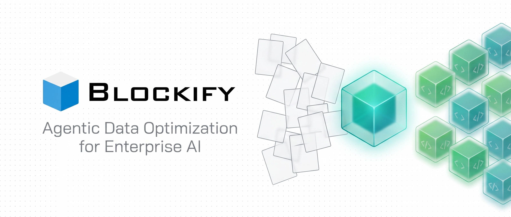
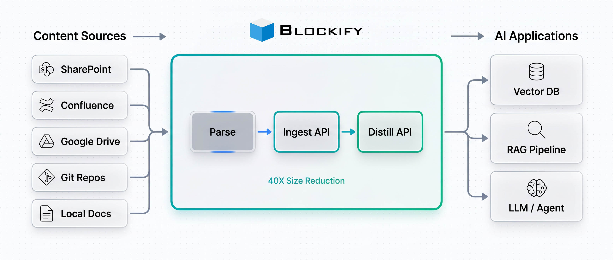
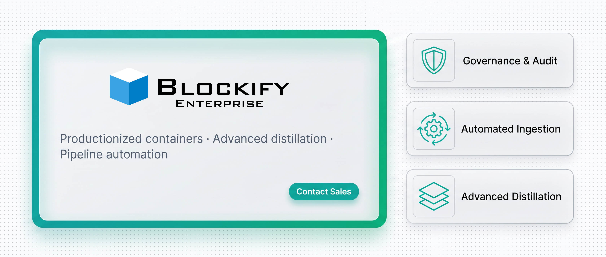
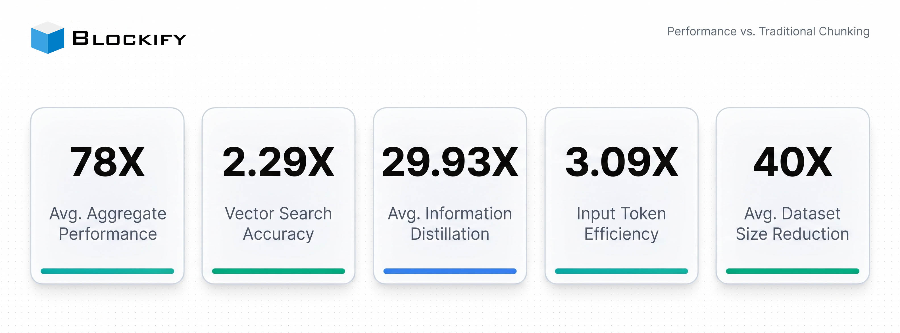

<!--
  Blockify — Agentic Data Optimization
  Patented data ingestion, distillation, and governance for enterprise AI
  https://blockify.ai | https://iternal.ai
-->

<p align="center">
  
</p>

<h3 align="center">Transform messy enterprise content into compact, validated knowledge units optimized for AI</h3>

<p align="center">
  <em>Patented data ingestion, distillation, and governance pipeline. IdeaBlocks replace naive chunking with structured, deduplicated, LLM-ready knowledge.</em>
</p>

<p align="center">
  
  
  
  
  
  
</p>

<p align="center">
  <strong>78X</strong> Aggregate Performance &nbsp;·&nbsp;
  <strong>2.29X</strong> Vector Search Accuracy &nbsp;·&nbsp;
  <strong>29.93X</strong> Distillation &nbsp;·&nbsp;
  <strong>3.09X</strong> Token Efficiency &nbsp;·&nbsp;
  <strong>40X</strong> Size Reduction
</p>

<p align="center">
  <a href="#quick-start"></a>
  &nbsp;
  <a href="https://console.blockify.ai"></a>
  &nbsp;
  <a href="https://console.blockify.ai/signup"></a>
  &nbsp;
  <a href="#enterprise-edition"></a>
</p>

---

## What is Blockify?

Traditional Retrieval-Augmented Generation (RAG) pipelines split documents into fixed-size chunks, then hope that vector similarity will surface the right context. It rarely does. Chunks break mid-sentence, duplicate content inflates token bills, and hallucinations slip through because the LLM is reasoning over fragments rather than facts.

**Blockify** replaces naive chunking with a patented ingestion and distillation pipeline that transforms raw enterprise content into **IdeaBlocks** — structured, semantically complete XML knowledge units. Every IdeaBlock carries its own question, trusted answer, tags, entities, and keywords. Similar blocks are deduplicated and merged so the knowledge base stays compact, coherent, and governable.

> [!TIP]
> An **IdeaBlock** is the smallest unit of curated knowledge: a self-contained XML unit with a `name`, `critical_question`, `trusted_answer`, `tags`, `entity`, and `keywords`. Unlike fixed-size chunks, IdeaBlocks preserve full semantic coherence.

---

## How It Works

<p align="center">
  
</p>

1. **Ingest** — Documents (SharePoint, Confluence, Git, local docs) are parsed and transformed into structured IdeaBlocks via the Blockify API
2. **Distill** — Similar blocks are clustered with embeddings + LSH, then merged by the `distill` LLM to eliminate duplicates while preserving distinct facts
3. **Retrieve** — Optimized blocks are stored in vector databases (ChromaDB, Pinecone, Cloudflare Vectorize, Neo4j) for high-accuracy RAG retrieval

---

## Features

| | |
|---|---|
| **Semantic Ingestion** — Transforms raw text into structured IdeaBlocks with question/answer alignment, entities, and tags | **Intelligent Distillation** — Deduplicates and merges similar blocks using embeddings, LSH clustering, and LLM synthesis |
| **40X Compression** — Reduces enterprise datasets to ~2.5% of original size while preserving 99%+ information fidelity | **2.29X Search Accuracy** — IdeaBlocks dramatically outperform naive chunks in vector similarity retrieval |
| **Production-Ready Service** — Docker, Helm, Prometheus metrics, OpenTelemetry tracing, health checks | **Claude Code Skill** — First-class integration as a Claude Code skill for developer workstations |
| **Pluggable Storage** — SQLite, PostgreSQL, Redis, or filesystem backends for the distillation service | **Benchmark Suite** — Built-in benchmarking with HTML reports to quantify ROI on your own data |

---

## Repository Structure

This repository contains two deployable components plus comprehensive technical documentation:

| Component | Description | Path |
|-----------|-------------|------|
| **Distillation Service** | FastAPI microservice for IdeaBlock deduplication and merging | [`blockify-distillation-service/`](./blockify-distillation-service/) |
| **Claude Code Skill** | Skill package for document ingestion, distillation, semantic search, and benchmarks | [`blockify-skill-for-claude-code/`](./blockify-skill-for-claude-code/) |
| **Documentation** | Technical guides covering architecture, API, setup, research, and 12 platform integrations | [`documentation/`](./documentation/) |

<details>
<summary>Full directory tree</summary>

```
blockify-agentic-data-optimization/
├── blockify-distillation-service/   FastAPI microservice
│   ├── app/                         Source (api, service, dedupe, llm, db)
│   ├── tests/                       Pytest suite
│   ├── helm/                        Kubernetes Helm chart
│   ├── Dockerfile
│   ├── docker-compose.yml
│   └── requirements.txt
├── blockify-skill-for-claude-code/  Claude Code skill package
│   └── skills/blockify-integration/
│       ├── SKILL.md                 Skill definition
│       ├── scripts/                 Ingest, distill, search, benchmark
│       ├── references/              API, schema, distillation docs
│       └── tests/
├── documentation/                   Technical guides + platform integrations
│   ├── BLOCKIFY-DEEP-DIVE.md
│   ├── BLOCKIFY-API-REFERENCE.md
│   ├── ARCHITECTURE-END-TO-END.md
│   ├── IDEABLOCK-STRUCTURE.md
│   ├── GETTING-STARTED-GUIDE.md
│   ├── LOCAL-VECTOR-DATABASE-SETUP.md
│   ├── DISTILLATION-SERVICE.md
│   ├── CLAUDE-CODE-BLOCKIFY-SKILL.md
│   ├── OPENCLAW-RAG-INTEGRATION.md
│   ├── RAG-AGENTIC-SEARCH-RESEARCH.md
│   └── integrations/                12 platform integration guides
│       ├── BLOCKIFY-OBSIDIAN.md
│       ├── BLOCKIFY-LLAMAINDEX.md
│       ├── BLOCKIFY-LANGCHAIN.md
│       ├── BLOCKIFY-N8N.md
│       ├── BLOCKIFY-ELASTIC.md
│       ├── BLOCKIFY-SUPABASE.md
│       ├── BLOCKIFY-STARBURST.md
│       ├── BLOCKIFY-KIBANA.md
│       ├── BLOCKIFY-CLOUDFLARE.md
│       ├── BLOCKIFY-MILVUS.md
│       ├── BLOCKIFY-ZILLIZ.md
│       └── BLOCKIFY-UNSTRUCTURED.md
├── assets/images/                   README visuals + AI image prompts
├── CONTRIBUTING.md
├── SECURITY.md
├── LICENSE
└── README.md
```

</details>

---

## Quick Start

> [!NOTE]
> New to Blockify? [Sign up for free](https://console.blockify.ai/signup) to get **$1,000 in API credits**, then pick the path below that fits your workflow.

### Path 1 — Test the API in 30 seconds

```bash
curl --location 'https://api.blockify.ai/v1/chat/completions' \
  --header 'Authorization: Bearer YOUR_API_KEY' \
  --header 'Content-Type: application/json' \
  --data '{
    "model": "ingest",
    "messages": [{"role": "user", "content": "Your text to process here"}],
    "max_tokens": 8000,
    "temperature": 0.5
}'
```

### Path 2 — Claude Code Skill (5 minutes)

```bash
git clone https://github.com/iternal-technologies-partners/blockify-agentic-data-optimization.git
cd blockify-agentic-data-optimization/blockify-skill-for-claude-code/skills/blockify-integration

pip install -r requirements.txt
python3 scripts/setup_check.py

# Ingest your docs, distill, and run semantic search
python3 scripts/run_full_pipeline.py --source ./my-docs
```

See [`blockify-skill-for-claude-code/`](./blockify-skill-for-claude-code/) for full skill documentation.

### Path 3 — Distillation Service (Docker)

```bash
cd blockify-distillation-service
cp .env.example .env
# Edit .env with your BLOCKIFY_API_KEY and OPENAI_API_KEY

docker-compose up -d

# Verify
curl http://localhost:8315/healthz
```

<details>
<summary>Path 4 — Deploy with Helm (Kubernetes)</summary>

```bash
cd blockify-distillation-service/helm/blockify-distillation

# Edit values.yaml with your config
helm install blockify-distill . --namespace blockify --create-namespace

kubectl get pods -n blockify
kubectl port-forward svc/blockify-distill 8315:8315 -n blockify
```

Supports Prometheus ServiceMonitor, PVC for SQLite persistence, Ingress, and Secret management out of the box.

</details>

---

## Enterprise Edition

<p align="center">
  
</p>

> [!IMPORTANT]
> The open-source components in this repository are a fully capable starting point. For production workloads at enterprise scale, **Blockify Enterprise** provides productionized containers with significantly expanded capabilities.

### What Enterprise Adds on Top of Open Source

| Capability | Open Source | Enterprise |
|------------|:-----------:|:----------:|
| IdeaBlock ingestion & distillation API | Yes | Yes |
| Self-hosted distillation microservice | Yes | Yes (hardened, pre-built containers) |
| Advanced distillation algorithms (hierarchical, multi-pass, domain-tuned) | — | Yes |
| Automated ingestion pipelines (scheduled connectors for SharePoint, Confluence, Drive, S3, Git) | — | Yes |
| Enterprise connectors & parsers (PDF, DOCX, PPTX, HTML, Markdown, structured data) | Basic | Full suite |
| Role-based access control & audit logging | — | Yes |
| Governance dashboard & content lifecycle management | — | Yes |
| Priority support & SLAs | — | Yes |
| Air-gapped / on-prem deployment (AirgapAI) | — | Yes |
| Professional services & implementation support | — | Yes |

**Who is Enterprise for?** Teams ingesting millions of documents, running regulated workloads, needing automated refresh pipelines, or deploying in air-gapped environments.

<p align="center">
  <a href="mailto:sales@iternal.ai?subject=Blockify%20Enterprise%20Inquiry"></a>
  &nbsp;
  <a href="https://iternal.ai/blockify"></a>
</p>

---

## API Models

The Blockify API exposes three models via an OpenAI-compatible chat completions endpoint:

| Model | API Name | Use Case |
|-------|----------|----------|
| Blockify Ingest | `ingest` | Convert raw text to IdeaBlocks |
| Blockify Distill | `distill` | Merge and deduplicate similar IdeaBlocks |
| Technical Manual Ingest | `technical-ingest` | Ordered content (manuals, procedures, runbooks) |

See [BLOCKIFY-API-REFERENCE.md](./documentation/BLOCKIFY-API-REFERENCE.md) for full endpoint documentation.

---

## The IdeaBlock Format

Every IdeaBlock is a self-contained XML knowledge unit:

```xml
<ideablock>
  <name>Blockify Overview</name>
  <critical_question>What is Blockify?</critical_question>
  <trusted_answer>Blockify is an agentic data optimization pipeline that converts unstructured enterprise content into compact, deduplicated XML IdeaBlocks to improve retrieval accuracy and reduce token usage in RAG and LLM workflows.</trusted_answer>
  <tags>RAG, DATA_OPTIMIZATION, KNOWLEDGE_MANAGEMENT</tags>
  <entity>
    <entity_name>BLOCKIFY</entity_name>
    <entity_type>PRODUCT</entity_type>
  </entity>
  <keywords>blockify, ideablock, RAG, distillation, deduplication, enterprise AI</keywords>
</ideablock>
```

<details>
<summary>Full field specification</summary>

| Field | Required | Purpose |
|-------|:--------:|---------|
| `name` | Yes | Short human-readable title |
| `critical_question` | Yes | The question this block answers |
| `trusted_answer` | Yes | Verified answer content |
| `tags` | Yes | Comma-separated topical tags |
| `entity` / `entity_name` | Yes | Primary entity (product, person, concept) |
| `entity` / `entity_type` | Yes | Entity classification |
| `keywords` | Yes | Search keywords for retrieval |

Full schema in [IDEABLOCK-STRUCTURE.md](./documentation/IDEABLOCK-STRUCTURE.md).

</details>

---

## Performance

<p align="center">
  
</p>

| Metric | Improvement | What It Means |
|--------|:-----------:|---------------|
| **Aggregate Enterprise Performance** | 78X | Combined effect across the full pipeline |
| **Vector Search Accuracy** | 2.29X | Measurably more relevant results, fewer false matches |
| **Information Distillation** | 29.93X | Enterprise-wide deduplication factor |
| **Token Efficiency** | 3.09X | Substantial cost savings at scale |
| **Dataset Size Reduction** | 40X | From 100% down to ~2.5% of original |

> [!TIP]
> Prove the numbers on your own data: run the built-in benchmark suite from the Claude Code skill — `python3 scripts/run_benchmark.py --company "Your Company"` — and get an HTML report comparing IdeaBlocks vs. traditional chunking.

---

## Documentation

| Document | Description | Audience |
|----------|-------------|----------|
| [Getting Started Guide](./documentation/GETTING-STARTED-GUIDE.md) | Step-by-step setup for any skill level | Everyone |
| [Blockify Deep Dive](./documentation/BLOCKIFY-DEEP-DIVE.md) | Complete technical understanding | All Engineers |
| [IdeaBlock Structure](./documentation/IDEABLOCK-STRUCTURE.md) | XML format specification | Data Engineers |
| [API Reference](./documentation/BLOCKIFY-API-REFERENCE.md) | API endpoints and examples | Backend Engineers |
| [Architecture (End-to-End)](./documentation/ARCHITECTURE-END-TO-END.md) | Complete integration architecture | Architects |
| [Distillation Service](./documentation/DISTILLATION-SERVICE.md) | Deduplication algorithm reference | Platform Engineers |
| [Local Vector DB Setup](./documentation/LOCAL-VECTOR-DATABASE-SETUP.md) | ChromaDB setup for 100k+ blocks | DevOps |
| [Claude Code Skill Guide](./documentation/CLAUDE-CODE-BLOCKIFY-SKILL.md) | Skill installation and usage | Claude Code users |
| [OpenClaw RAG Integration](./documentation/OPENCLAW-RAG-INTEGRATION.md) | Chatbot + Blockify implementation | Full-Stack Engineers |
| [RAG & Agentic Search Research](./documentation/RAG-AGENTIC-SEARCH-RESEARCH.md) | Architecture patterns research | All Engineers |
| [Platform Integrations](./documentation/integrations/README.md) | 12 integration guides (Obsidian, LlamaIndex, LangChain, n8n, Elastic, Supabase, Starburst, Kibana, Cloudflare, Milvus, Zilliz, Unstructured.io) | All Engineers |

---

## Integrations

Blockify sits between your document source and your retrieval / storage layer. It plugs into every major RAG framework, vector database, data platform, and workflow engine. Each guide below covers the problem Blockify solves on that stack, an architecture diagram, quick-start code, advanced patterns, and a side-by-side comparison with the platform's default behavior.

### RAG Frameworks

| Platform | Use Case | Guide |
|---|---|---|
| **LlamaIndex** | Drop-in `NodeParser` producing deduplicated `TextNode`s | [Blockify + LlamaIndex](./documentation/integrations/BLOCKIFY-LLAMAINDEX.md) |
| **LangChain** | `BaseDocumentTransformer` for any RAG chain or LangGraph agent | [Blockify + LangChain](./documentation/integrations/BLOCKIFY-LANGCHAIN.md) |

### Knowledge & Workflow

| Platform | Use Case | Guide |
|---|---|---|
| **Obsidian** | Turn a personal or team vault into a high-accuracy RAG knowledge base | [Blockify + Obsidian](./documentation/integrations/BLOCKIFY-OBSIDIAN.md) |
| **n8n** | No-code HTTP node for AI workflow automation | [Blockify + n8n](./documentation/integrations/BLOCKIFY-N8N.md) |

### Vector & Search Databases

| Platform | Use Case | Guide |
|---|---|---|
| **Milvus** | Self-hosted billion-scale vector DB with hybrid dense + BM25 retrieval | [Blockify + Milvus](./documentation/integrations/BLOCKIFY-MILVUS.md) |
| **Zilliz Cloud** | Managed Milvus with autoscaling and serverless pricing | [Blockify + Zilliz Cloud](./documentation/integrations/BLOCKIFY-ZILLIZ.md) |
| **Elastic** | Hybrid BM25 + ELSER + dense retrieval on deduplicated IdeaBlocks | [Blockify + Elastic](./documentation/integrations/BLOCKIFY-ELASTIC.md) |
| **Supabase** | Postgres + pgvector with row-level security on IdeaBlock tags | [Blockify + Supabase](./documentation/integrations/BLOCKIFY-SUPABASE.md) |
| **Cloudflare** | Edge-native RAG on Workers + Vectorize + R2 + Workers AI | [Blockify + Cloudflare](./documentation/integrations/BLOCKIFY-CLOUDFLARE.md) |

### Data Platform & Observability

| Platform | Use Case | Guide |
|---|---|---|
| **Starburst** | Federated IdeaBlock generation across data-lake catalogs (Trino / Iceberg) | [Blockify + Starburst](./documentation/integrations/BLOCKIFY-STARBURST.md) |
| **Kibana** | Governance dashboards for knowledge-base coverage, drift, and retrieval | [Blockify + Kibana](./documentation/integrations/BLOCKIFY-KIBANA.md) |

### Document Parsing

| Platform | Use Case | Guide |
|---|---|---|
| **Unstructured.io** | Parse PDF, DOCX, PPTX, HTML, email, images — then Blockify | [Blockify + Unstructured.io](./documentation/integrations/BLOCKIFY-UNSTRUCTURED.md) |

> [!TIP]
> See the full [integrations index](./documentation/integrations/README.md) for pattern references. Don't see your stack? Blockify exposes an OpenAI-compatible API — if your platform can POST HTTP, it can use Blockify.

### Generic Pattern

```
Documents -> Parser -> Blockify (Ingest + Distill) -> Embeddings -> Vector DB -> LLM / Agent
```

**Claude Code** — Install the skill (see [Path 2](#quick-start)) to let Claude Code ingest project documentation into local ChromaDB and perform high-accuracy semantic retrieval during development work.

**Chatbot & Customer Support** — Blockify-processed knowledge reduces hallucination risk and improves answer quality in production chatbots. See [OPENCLAW-RAG-INTEGRATION.md](./documentation/OPENCLAW-RAG-INTEGRATION.md) for a Cloudflare Workers example.

---

## Frequently Asked Questions

### What is Blockify and how is it different from naive RAG chunking?

Blockify is a patented ingestion and distillation pipeline that replaces fixed-size text chunking with **IdeaBlocks** — structured XML knowledge units containing a name, critical question, trusted answer, tags, entity, and keywords. Unlike `RecursiveCharacterTextSplitter` (LangChain) or `SentenceSplitter` (LlamaIndex), Blockify is semantically aware, deduplicates across the corpus, and produces ~2.5% of the original dataset size while preserving 99%+ information fidelity.

### How does Blockify improve vector search accuracy?

On real enterprise corpora, Blockify delivers **2.29X improvement in vector search precision** (average-distance-to-best-match from 0.3624 to 0.1585). Because duplicates are collapsed before vectorization, the top-K neighbors are semantically distinct rather than near-duplicates of the same boilerplate.

### Does Blockify work with my existing vector database?

Yes. Blockify is embedding-model and vector-database agnostic. There are dedicated integration guides for [Milvus](./documentation/integrations/BLOCKIFY-MILVUS.md), [Zilliz Cloud](./documentation/integrations/BLOCKIFY-ZILLIZ.md), [Elastic](./documentation/integrations/BLOCKIFY-ELASTIC.md), [Supabase](./documentation/integrations/BLOCKIFY-SUPABASE.md), and [Cloudflare Vectorize](./documentation/integrations/BLOCKIFY-CLOUDFLARE.md). Pinecone, ChromaDB, Qdrant, Weaviate, and pgvector work through the LangChain and LlamaIndex adapters.

### Does Blockify replace LlamaIndex or LangChain?

No — Blockify **composes with** LlamaIndex and LangChain. It replaces the chunking stage (`NodeParser` / `TextSplitter`) with a higher-quality transformer that produces IdeaBlock-backed nodes or documents. See [Blockify + LlamaIndex](./documentation/integrations/BLOCKIFY-LLAMAINDEX.md) and [Blockify + LangChain](./documentation/integrations/BLOCKIFY-LANGCHAIN.md).

### How does Blockify reduce LLM token costs?

Blockify delivers **3.09X token efficiency** — ~98 tokens per retrieved block vs. ~303 per traditional chunk. On 1B queries/year this translates to ~$738,000 in token cost savings. Cost reduction comes from two compounding sources: (1) 40X fewer embeddings to generate and store, and (2) denser retrieved context means fewer tokens per LLM call.

### What's the difference between Blockify Ingest and Blockify Distill?

**Ingest** converts raw text into draft IdeaBlocks. **Distill** clusters similar IdeaBlocks (embeddings + LSH + LLM synthesis) and merges them into canonical blocks, eliminating duplicates. A typical pipeline runs Ingest per-document then Distill across the corpus. Both are exposed as models via the same OpenAI-compatible API.

### Can Blockify run air-gapped / offline?

Yes. The open-source distillation service runs fully offline with a local LLM runtime (VLLM, NVIDIA NIM, Intel OpenVino). Blockify Enterprise ships air-gapped deployment (AirgapAI) with hardened containers for classified environments.

### Is Blockify open source?

The Claude Code skill, distillation microservice, Helm chart, benchmark suite, and 12 integration guides in this repository are open source under the [Blockify EULA](./LICENSE). Blockify Enterprise adds hardened containers, scheduled connectors, RBAC, governance dashboards, and professional services — see [Enterprise Edition](#enterprise-edition).

### How do I migrate from naive chunking to Blockify?

Three paths: (1) run the [Claude Code skill](./blockify-skill-for-claude-code/) against your docs for immediate local results, (2) add a single HTTP call to `api.blockify.ai/v1/chat/completions` in your existing pipeline, or (3) self-host the [distillation service](./blockify-distillation-service/) via Docker or Helm. The [Getting Started Guide](./documentation/GETTING-STARTED-GUIDE.md) walks through all three.

### What document formats does Blockify support?

Via Unstructured.io or native parsers: DOCX, PDF, PPTX, PNG/JPG (OCR), Markdown, HTML, email. See [Blockify + Unstructured.io](./documentation/integrations/BLOCKIFY-UNSTRUCTURED.md) for the recommended parsing pipeline.

---

## Contributing

Contributions are welcome. See [CONTRIBUTING.md](./CONTRIBUTING.md) for development setup, code style, and the pull request process.

> [!NOTE]
> This project is governed by the [Blockify Community License](./LICENSE). By contributing, you agree that your contributions will be subject to these terms, including the Contribution License (Section 2.4).

Security issues should be reported privately — see [SECURITY.md](./SECURITY.md).

---

## Support & Community

| Channel | Link |
|---------|------|
| **Enterprise Sales** (productionized containers) | sales@iternal.ai |
| **Technical Support** | support@iternal.ai |
| **Website** | [iternal.ai/blockify](https://iternal.ai/blockify) |
| **API Console** | [console.blockify.ai](https://console.blockify.ai) |
| **GitHub Issues** | [Open an issue](https://github.com/iternal-technologies-partners/blockify-agentic-data-optimization/issues) |

---

<details>
<summary>Star History</summary>

[](https://star-history.com/#iternal-technologies-partners/blockify-agentic-data-optimization&Date)

</details>

---

## License

This project is licensed under the [Blockify Community License](./LICENSE). Free for developers, researchers, and companies under $1M annual revenue. Organizations exceeding $1M annual revenue require an enterprise license — contact [sales@iternal.ai](mailto:sales@iternal.ai). See [ENTERPRISE.md](./ENTERPRISE.md) for details on enterprise capabilities.

<p align="center">
  <sub><em>Blockify</em>, <em>IdeaBlock</em>, and <em>AirgapAI</em> are trademarks of <a href="https://iternal.ai">Iternal Technologies, Inc.</a></sub>
</p>
